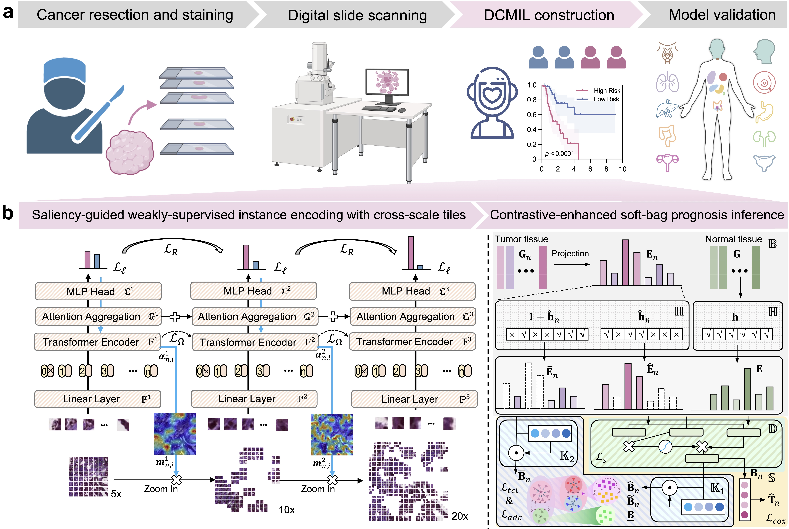

Dual-Curriculum Contrastive Multi-Instance Learning for Cancer Prognosis Analysis with Whole Slide Images
=====================================
<details>
<summary>
  <b>Dual-Curriculum Contrastive Multi-Instance Learning for Cancer Prognosis Analysis with Whole Slide Images</b>.
  <a href="" target="blank">[HTML]</a>
    <br><em><a>Chao Tu</a>, <a>Yu Zhang*</a>, <a>Zhenyuan Ning*</a></em></br>
</summary>

```bash

```
</details>

## Abstract
The burgeoning discipline of computational pathology shows promise in harnessing whole slide images (WSIs) to quantify morphological heterogeneity and develop objective prognostic modes for human cancers. However, progress is impeded by the computational bottleneck of gigapixel-size inputs and the scarcity of dense manual annotations. Current methods often overlook fine-grained information across multi-magnification WSIs and variations in tumor microenvironments. Here, we propose an easy-to-hard progressive representation learning model, termed dual-curriculum contrastive multi-instance learning (DCMIL), to efficiently process WSIs for cancer prognosis. The model does not rely on dense annotations and enables the direct transformation of gigapixel-size WSIs into outcome predictions. Extensive experiments on twelve cancer types (5,954 patients, 12.54 million tiles) demonstrate that DCMIL outperforms standard WSI-based prognostic models. Additionally, DCMIL identifies fine-grained prognosis-salient regions, provides robust instance uncertainty estimation, and captures morphological differences between normal and tumor tissues, with the potential to generate new biological insights. All codes have been made publicly accessible at https://github.com/tuuuc/DCMIL.



## License & Usage 
If you find our work useful in your research, please consider citing our paper at:
```bash

@article{tu2022dual,
  title={Dual-curriculum contrastive multi-instance learning for cancer prognosis analysis with whole slide images},
  author={Tu, Chao and Zhang, Yu and Ning, Zhenyuan},
  journal={Advances in neural information processing systems},
  volume={35},
  pages={29484--29497},
  year={2022}
}
```
